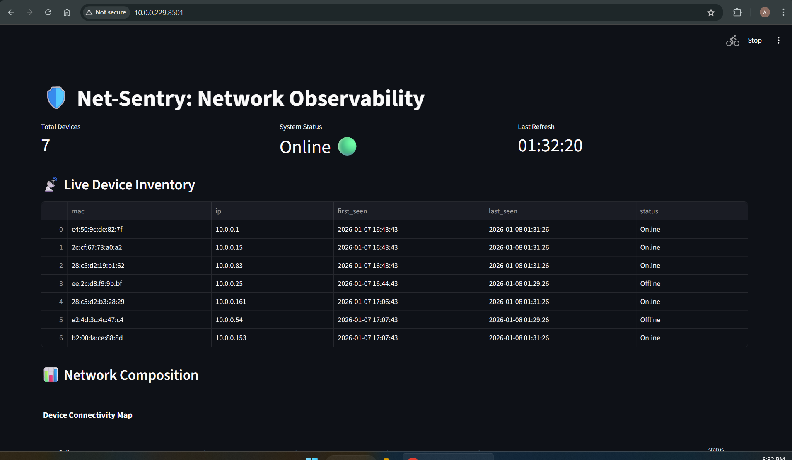
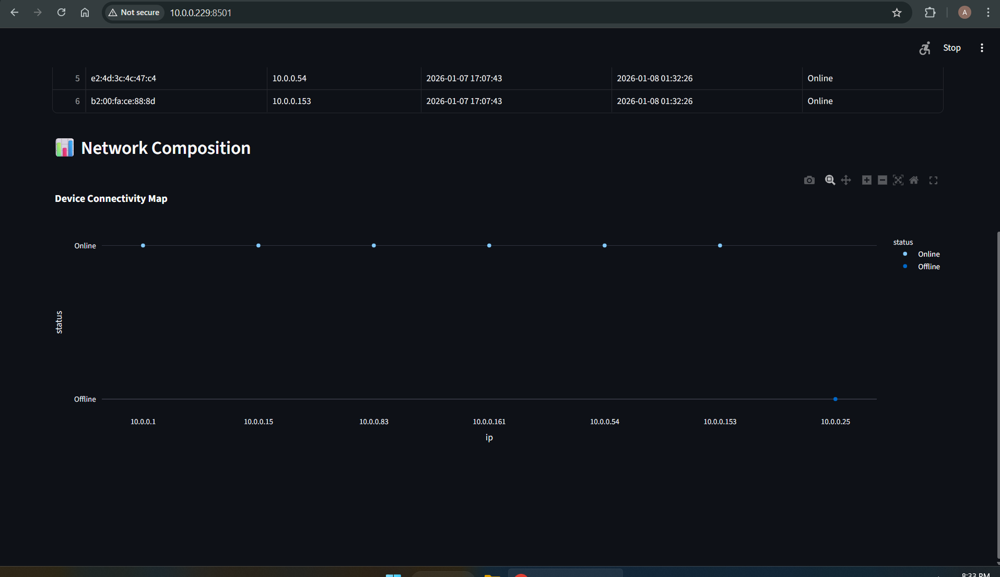
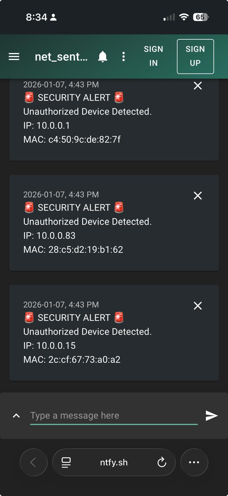
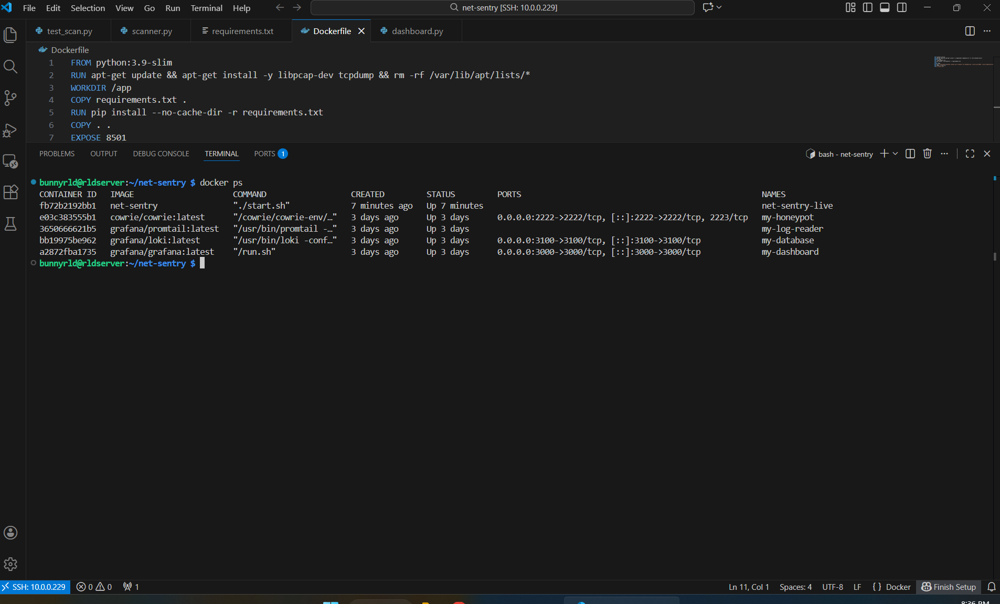

# Net-Sentry 🛡️

I built this tool because I wanted to know exactly who was connecting to my home WiFi.

Usually, your router is a "black box"—you don't know what's happening inside. Net-Sentry fixes that. It runs on my Raspberry Pi and acts like a 24/7 security guard for the network.

## How it works

Every 60 seconds, it scans the network to see who is there. It keeps a database of every device it has ever seen.

* **If it sees a known device** (like my laptop), it updates the "Last Seen" time.
* **If it sees a new device** it's never seen before, it immediately sends a security alert to my phone.

I also built a web dashboard so I can easily see the history of devices coming online and going offline.

## Screenshots

### 1. The Dashboard
This runs on a webpage hosted by the Pi. It shows me live data on who is currently online versus offline.

### 2. The Rogue Device Alert
If a stranger joins the WiFi, my phone buzzes instantly with their IP and MAC address.

### 3. Running in the Background
I used Docker to containerize the project. This means it runs silently in the background and automatically restarts if the Pi reboots.

---

## How to Run It

If you want to run this on your own Raspberry Pi:

1.  **Clone the repo:**
    `git clone https://github.com/AswathyAln/net-sentry.git`

2.  **Build the Docker container:**
    `cd net-sentry`
    `docker build -t net-sentry .`

3.  **Start it up:**
    `docker run -d --name net-sentry-live --net=host --restart=always net-sentry`